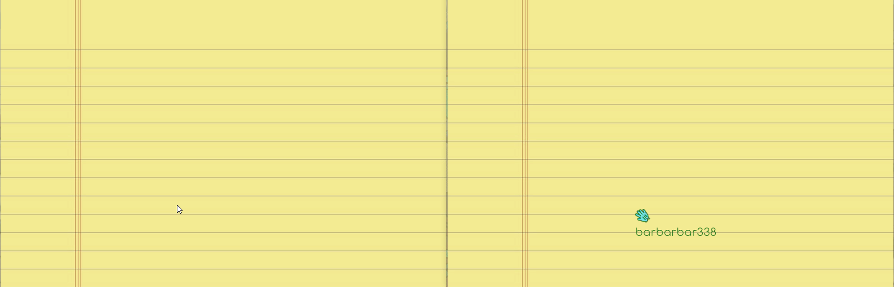

# ✨ Realtime drawing application

Draw something with your friends in real time! Your drawings, cursor location, username and color are transmitted to your friends in real time. Made with Socket.io

# 🚀 Example

# 🏃‍♀️ Running

-   Run `yarn build` or `npm run build` to build server files 🚧
-   Run `yarn start` or `npm run start` to start server 🔥
-   Go to `http://localhost:3000` to see what's going on 😳

# 🧶 Customization

To change your username or color, just delete `id` data in your local storage and go to `http://localhost:3000`.

# 🧦 Contributing

Feel free to use GitHub's features.
